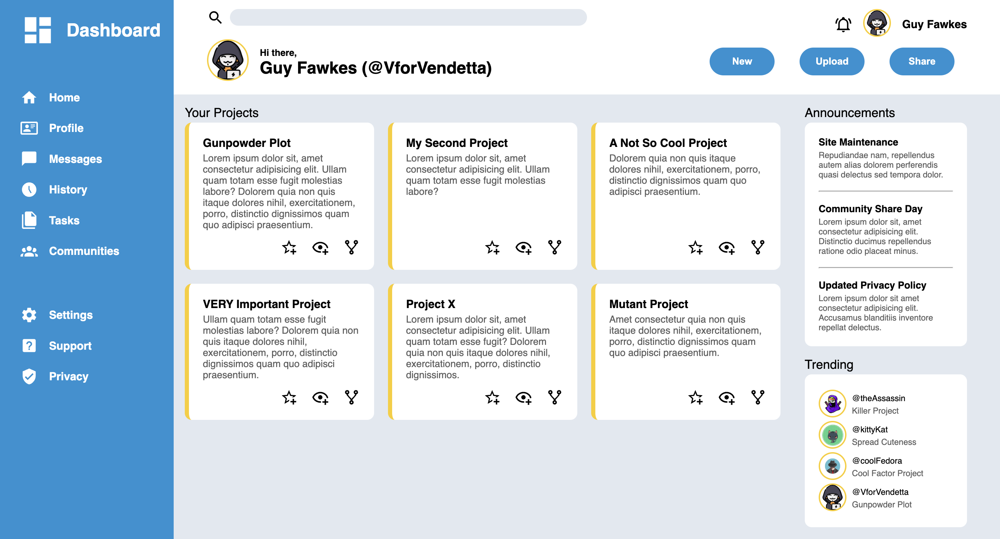
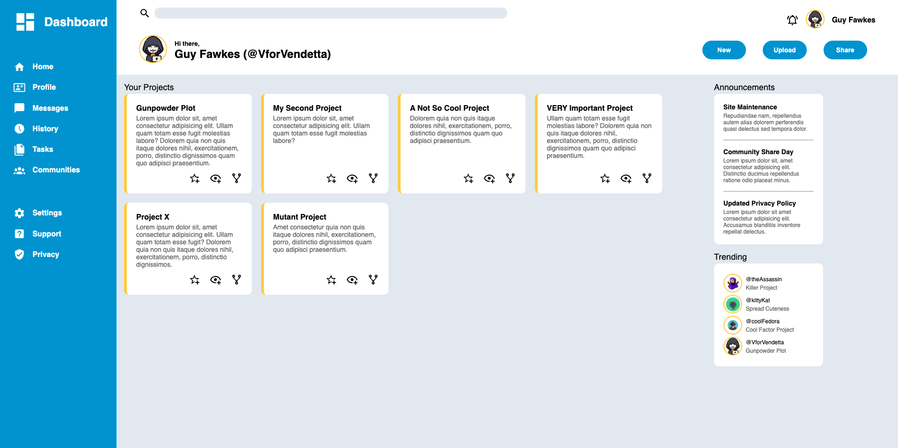

# Pure HTML/CSS Admin Dashboard

Admin dashboard made with pure HTML and CSS for the final project of the Intermediate HTML and CSS Course for TOP

Link to project spec: https://www.theodinproject.com/lessons/node-path-intermediate-html-and-css-admin-dashboard

## Project Showcase

### UI on small screen

### UI on wide screen

## Credits

<a href="https://www.flaticon.com/free-icons/hacker" title="hacker icons">Hacker icons created by Freepik - Flaticon</a>

<a href="https://www.freepik.com/free-vector/coloured-cat-background_899090.htm#fromView=search&page=2&position=8&uuid=e95f615f-4fb3-40dc-a809-8e1b1f2aab50">Image by tamaratorres on Freepik</a>

<a href="https://www.freepik.com/free-vector/mysterious-gangster-character-illustration_7079939.htm#fromView=search&page=1&position=7&uuid=2a406fe2-3799-4f00-96d8-3b7a5da61ef3">Image by freepik</a>

<a href="https://www.freepik.com/free-vector/assassin-with-two-swords-esport-gaming_11760297.htm#fromView=image_search_similar&page=1&position=0&uuid=cf9305c3-863d-4eae-9ab6-3b43b2db7ded">Image by benzoix on Freepik</a>
